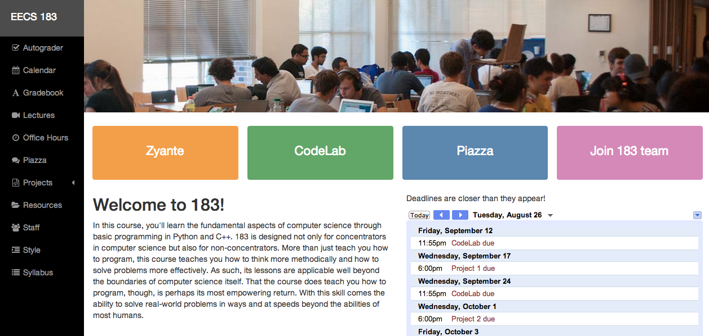

EECS 183
=========

This is the repository for the website of EECS 183 at the University of Michigan. As with most of our new additions, it's open source. Anyone is free to propose changes or additions to the site.

Where is it?
=========
[http://umich.edu/~eecs183](http://umich.edu/~eecs183)

Credits
=========

Credit for the initial design goes to [Steve Merritt](http://github.com/stevemer), but the vast majority of the codebase was written by [Maxim Aleksa](http://www-personal.umich.edu/~maximal/) with the help of [William (Billy) Wolfington](http://github.com/thewolfA2). The website is continuously open to improvement, so feel free to help out!

License:
=========

The MIT License (MIT)

Permission is hereby granted, free of charge, to any person obtaining a copy of this software and associated documentation files (the "Software"), to deal in the Software without restriction, including without limitation the rights to use, copy, modify, merge, publish, distribute, sublicense, and/or sell copies of the Software, and to permit persons to whom the Software is furnished to do so, subject to the following conditions:

The above copyright notice and this permission notice shall be included in all copies or substantial portions of the Software.

THE SOFTWARE IS PROVIDED "AS IS", WITHOUT WARRANTY OF ANY KIND, EXPRESS OR IMPLIED, INCLUDING BUT NOT LIMITED TO THE WARRANTIES OF MERCHANTABILITY, FITNESS FOR A PARTICULAR PURPOSE AND NONINFRINGEMENT. IN NO EVENT SHALL THE AUTHORS OR COPYRIGHT HOLDERS BE LIABLE FOR ANY CLAIM, DAMAGES OR OTHER LIABILITY, WHETHER IN AN ACTION OF CONTRACT, TORT OR OTHERWISE, ARISING FROM, OUT OF OR IN CONNECTION WITH THE SOFTWARE OR THE USE OR OTHER DEALINGS IN THE SOFTWARE.
